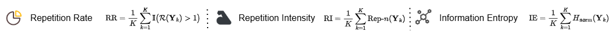
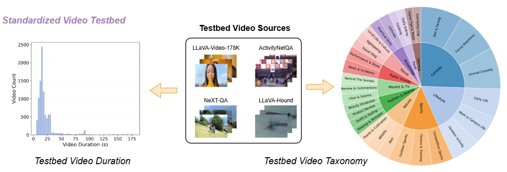
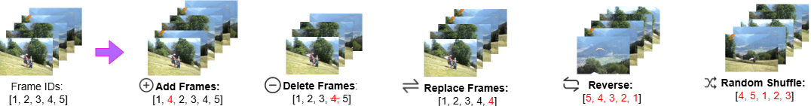

# 🎥 VideoSTF: An Evaluation Benchmark for Stress-Testing Output Repetition in Video Large Language Models

VideoSTF is the first benchmark for systematically measuring and stress-testing output repetition in Video Large Language Models (VideoLLMs).

VideoSTF evaluates repetition using three complementary n-gram-based metrics (Repetition Rate, Repetition Intensity and Information Entropy) and provides a standardized, extensible testbed that covers diverse videos from public datasets, together with a library of controlled temporal transformations. VideoSTF currently supports three evaluations: Pervasive Testing, Temporal Stress Testing, and Adversarial Exploitation across 10 mainstream VideoLLMs.

---

## 📏 Metrics

VideoSTF reports three repetition metrics, computed over a set of $K$ model outputs.

### Repetition Rate (RR)
RR captures whether repetition occurs in an output. An output is marked as repetitive if it contains at least 1 repeated $n$-gram. Higher RR indicates repetition appears more frequently across outputs.

### Repetition Intensity (RI)
RI quantifies the extent of duplicated patterns. It uses the standard Rep-$n$ to measure the proportion of duplicated $n$-grams in each output. Higher RI indicates stronger repetitive patterns.

### Information Entropy (IE)
IE measures repetition through lexical diversity by capturing the diversity of $n$-grams. Lower entropy indicates lower lexical diversity and more severe repetition.

## 🎞️ Video Testbed

We construct a video testbed by randomly sampling videos from several publicly available video datasets:

- [LLaVA-Video-178K](https://huggingface.co/datasets/lmms-lab/LLaVA-Video-178K)
- [NeXT-QA](https://huggingface.co/datasets/lmms-lab/NExTQA)
- [ActivityNetQA](https://huggingface.co/datasets/lmms-lab/ActivityNetQA)
- [LLaVA-Hound](https://huggingface.co/ShareGPTVideo/LLaVA-Hound-Pretrain)

The resulting collection exhibits substantial diversity in both temporal length and semantic content. Video durations range from short clips to moderately long videos, while the content spans a wide variety of everyday scenarios, with categories such as comedy, lifestyle, and sports appearing frequently.

## 🌀 Temporal Stressor Library

VideoSTF evaluates temporal robustness via a set of temporal stressors applied to input videos. The library includes five common temporal transformations: Add, Delete, Replace, Reverse, and Shuffle that capture different ways of modifying temporal structure.

## 🤖 VideoLLMs
Currently, VideoSTF supports tests of 10 mainstream VideoLLMs, including seven LLM-centric models and three native multimodal models.

### LLM-Centric Models
- [LLaVA-Video-7B-Qwen2](https://github.com/LLaVA-VL/LLaVA-NeXT)
- [LLaVA-Video-7B-Qwen2-Video-Only](https://github.com/LLaVA-VL/LLaVA-NeXT)
- [LLaVA-NeXT-Video-7B](https://github.com/LLaVA-VL/LLaVA-NeXT)
- [LLaVA-NeXT-Video-7B-DPO](https://github.com/LLaVA-VL/LLaVA-NeXT)
- [LLaVA-NeXT-Video-32B-Qwen](https://github.com/LLaVA-VL/LLaVA-NeXT)
- [VideoLLaMA2](https://github.com/DAMO-NLP-SG/VideoLLaMA2)
- [ShareGPT4Video](https://github.com/ShareGPT4Omni/ShareGPT4Video)

### Native Multimodal Models
- [InternVL3.5-8B](https://huggingface.co/OpenGVLab/InternVL3_5-8B)
- [Qwen3-VL-8B-Instruct](https://huggingface.co/Qwen/Qwen3-VL-8B-Instruct)
- [Molmo2-8B](https://huggingface.co/allenai/Molmo2-8B)

## 🛠️ Environment Setup
Since different VideoLLMs require different versions of packages, such as transformers, we recommend using separate conda environments.

### Recommended Environment Mapping

<b><code>llava</code></b>  
Reference: [LLaVA-NeXT](https://github.com/LLaVA-VL/LLaVA-NeXT)  
Models: LLaVA-Video-7B-Qwen2, LLaVA-Video-7B-Qwen2-Video-Only, LLaVA-NeXT-Video-7B, LLaVA-NeXT-Video-7B-DPO, LLaVA-NeXT-Video-32B-Qwen

<b><code>sg4v</code></b>  
Reference: [ShareGPT4Video](https://github.com/ShareGPT4Omni/ShareGPT4Video)  
Models: VideoLLaMA2, ShareGPT4Video  
Requirement: transformers>=4.45.0

<b><code>multimodal</code></b>  
Reference: [InternVL3.5-8B](https://huggingface.co/OpenGVLab/InternVL3_5-8B)  
Models: InternVL3.5-8B, Qwen3-VL-8B-Instruct, Molmo2-8B  
Requirement: transformers>=4.55.4

### Template

~~~bash
conda create -n llava python=3.10 -y
conda activate llava
# TODO: add model specific installs here
~~~

## 🧪 Testing Suites

VideoSTF includes three testing suites. All suites share a common runner interface with the following common parameters.

| Argument | Type | Description |
| --- | --- | --- |
| `--adapter` | `str` | Model adapter identifier (see supported adapters below). |
| `--input_folder` | `str` | Path to the input videos directory. |
| `--output_folder` | `str` | Output folder name. |
| `--max_frames_num` | `int` | Number of frames sampled per video. |
| `--temperature` | `float` | Decoding temperature. Set to `0.0` for deterministic generation. |
| `--gpu` | `str` | GPU index. |
| `--cache_dir` | `str` | Cache directory to save model weights and processor. |

**Supported adapters:** `llava_video_7b_qwen2`, `llava_video_7b_qwen2_video_only`, `llava_next_video_7b`, `llava_next_video_7b_dpo`, `llava_next_video_32b_qwen`, `videollama2`, `sharegpt4video`, `internvl35_8b`, `qwen3vl_8b`, `molmo2_8b`.

### 📋 1. Pervasive Testing
VideoSTF tests each VideoLLM under varying numbers of sampled frames, treating temporal granularity as a controlled variable to comprehensively study the output repetition under natural inputs.

---

#### 🚀 Quick Start

~~~bash
python -m runners.batch_infer \
  --adapter llava_video_7b_qwen2_video_only \
  --input_folder your/video/path \
  --output_folder infer_7bqwen2videoonly_16 \
  --max_frames_num 16 \
  --temperature 0.0 \
  --gpu 0 \
  --cache_dir your/cache/dir
~~~

---

#### 📦 Outputs
- Outputs are saved as JSON files in `runners/infer_results/infer_7bqwen2videoonly_16/`.
- JSON files record the model output and the results of the three metrics.

### 2. ⏱️ Temporal Stress Testing
VideoSTF tests VideoLLMs under temporal stressors by applying controlled temporal transformations that preserve semantic content while perturbing temporal structure.

---

#### 🚀 Quick Start

~~~bash
python -m runners.batch_test \
  --adapter llava_video_7b_qwen2_video_only \
  --input_folder your/video/path \
  --output_folder test_7bqwen2videoonly_16 \
  --max_frames_num 16 \
  --temperature 0.0 \
  --gpu 0 \
  --cache_dir your/cache/dir
~~~

---

#### 📦 Outputs
- Outputs are saved as JSON files and CSV files in `runners/test_results/test_7bqwen2videoonly_16/`.
- JSON files record the model output.
- CSV files record the results of the three metrics under different temporal stressors.

### 3. 🎯 Adversarial Exploitation
VideoSTF evaluates whether temporal stressors can be exploited to induce repetition for those videos with normal outputs in a black-box adversarial setting.

---

#### 🚀 Quick Start

~~~bash
python -m runners.batch_attack \
  --adapter llava_video_7b_qwen2_video_only \
  --input_folder your/video/path \
  --output_folder attack_7bqwen2videoonly_16 \
  --max_frames_num 16 \
  --temperature 0.0 \
  --gpu 0 \
  --cache_dir your/cache/dir
~~~

---

#### 📦 Outputs
- Outputs are saved as JSON files and CSV files in `runners/attack_results/attack_7bqwen2videoonly_16/`.
- JSON files contain model generations.
- CSV files record whether the attack succeeds under the temporal stressors and the number of queries required.

## 📜 License

This project is distributed under the MIT License. See `LICENSE.md` for details.

**Disclaimer:** This tool is intended solely for educational and authorized security testing. The authors do not condone any unlawful or unauthorized use. Users are solely responsible for ensuring compliance with applicable laws and obtaining any required permissions.

## 🤝 Contributions

We welcome contributions that add new VideoLLMs, metrics, stressors, or testing suites to VideoSTF. If you are interested, please submit a pull request.

